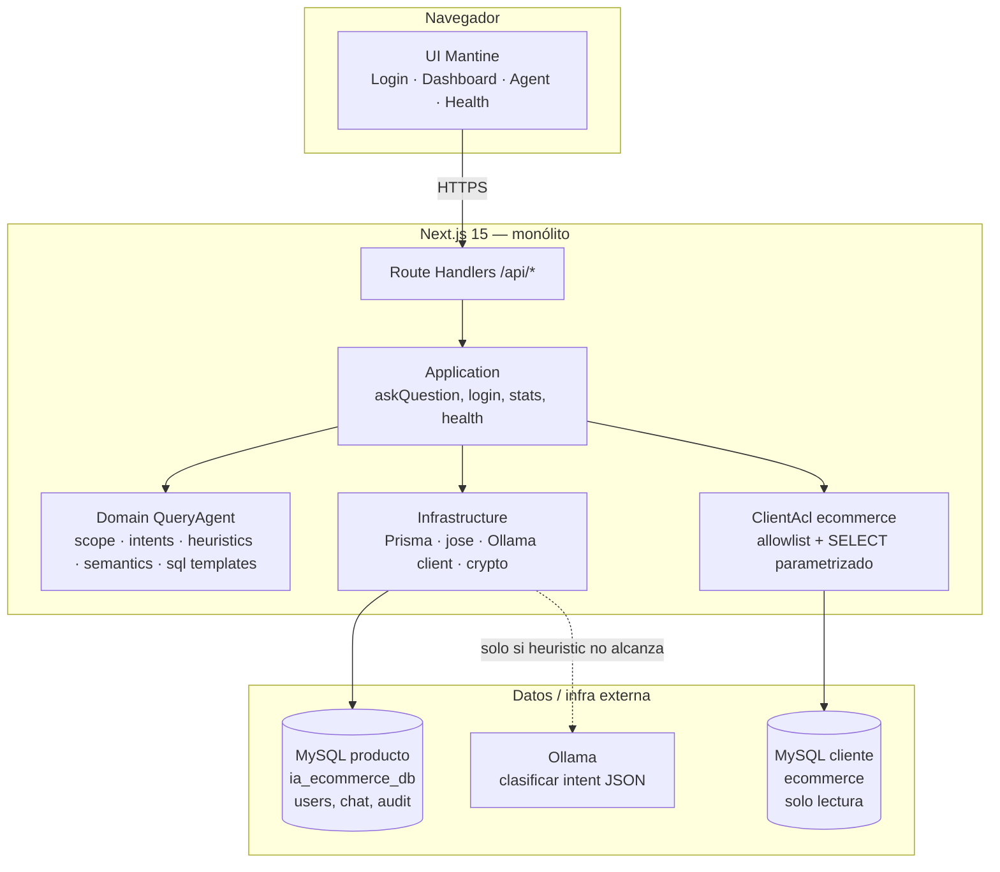
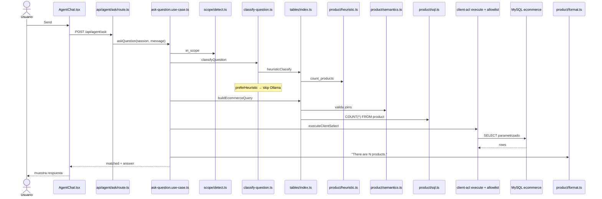

# IA-ECOMMERCE v3

Chat en inglés que responde con datos reales del ERP del cliente (**solo lectura**).  
MVP: MySQL AdventureWorks-style `ecommerce`. Un deploy Next.js (UI + API).

Documentación detallada: [docs/README.md](docs/README.md).

---

## 1. ¿Qué es la app?

| Pantalla | Qué hace |
|---|---|
| **Login** | Empleado piloto (`founder` / `founder123`). JWT en cookie httpOnly. |
| **Dashboard** | KPIs y gráficos de uso del agente (últimos 7 días) desde `ai_query_audit_log`. |
| **SQL Agent** | Pregunta en lenguaje natural → intent fijo → SELECT seguro → respuesta en inglés. |
| **Health** | UP/DOWN de app, MySQL producto, BD cliente y Ollama. |

**No hace:** create/update/delete en el ERP, Maintenance/CRUD, SQL libre generado por el LLM.

---

## 2. Arquitectura (qué uso y por qué)

**Estilo:** *Modular monolith* + *Hexagonal (ports & adapters)* dentro de Next.js ([ADR-001](docs/architecture/ADR/ADR-001-architecture.md)).

- **Un monólito** → un solo deploy; suficiente para un operador/piloto.
- **Capas hacia adentro** → el dominio no importa Prisma ni Ollama; se puede cambiar infra sin reescribir el chat.
- **ACL por `system_type`** → el ERP del cliente no contamina nuestro dominio; solo SELECT allowlisted.
- **LLM clasifica, no escribe SQL** → intents fijos + builders deterministas ([ADR-004](docs/architecture/ADR/ADR-004-query-engine.md)).



| Bloque del diagrama | Para qué sirve | Por qué lo uso |
|---|---|---|
| **UI Mantine** | Pantallas y formularios. | UI rápida, consistente, sin reinventar componentes. |
| **Route Handlers** | Entrada HTTP (`/api/auth`, `/api/agent/ask`, …). | API dentro del mismo Next; un solo deploy. |
| **Application** | Casos de uso (orquestan el flujo). | Reglas de aplicación testeables, fuera de React. |
| **Domain QueryAgent** | Catálogo de intents, scope, SQL templates. | El “qué se puede preguntar” vive en código versionado. |
| **ClientAcl** | Traduce `QueryPlan` → SELECT bound + allowlist. | Aísla el esquema del cliente; evita inyección. |
| **Infrastructure** | Prisma, JWT, fetch a Ollama. | Detalles técnicos al borde; sustituibles. |
| **MySQL producto** | Login, conversación del día, auditoría, suggestions. | Nuestro modelo; no es el ERP. |
| **MySQL cliente** | Productos, órdenes, reviews, customers. | Fuente de verdad comercial; **read-only**. |
| **Ollama** | Si el heuristic no cierra, propone intent JSON. | Clasificación local; **nunca** genera SQL ejecutable. |

### Patrones que verás en el código

| Patrón | Dónde |
|---|---|
| Use case / application service | `src/query-agent/application/ask-question.use-case.ts` |
| Registry + strategy (módulos por tabla) | `src/query-agent/domain/tables/index.ts` |
| Pipeline | scope → classify → build → execute → format → audit |
| Semantic layer (contrato por intent) | `*/semantics.ts` + `domain/semantics/validate.ts` |
| Anti-Corruption Layer | `src/client-acl/ecommerce/` |

---

## 3. Tecnologías (qué / para qué / por qué)

| Tecnología | Para qué | Por qué la uso |
|---|---|---|
| **Next.js 15** (App Router) | UI + API en un repo. | Un deploy, SSR/rutas claras, TypeScript first-class. |
| **React 19** | Componentes de pantalla. | Estándar del stack Next. |
| **TypeScript** | Tipado de planes, DTOs, SQL builders. | Menos errores en intents y contratos API. |
| **Mantine 7** | Layout, forms, tables, notifications. | Productividad UI admin/B2B. |
| **Recharts** | Dashboard + charts reutilizables (`presentation/charts`). | Gráficos declarativos; listos para el agent después. |
| **react-icons** | Iconografía del shell y tips. | Ligero y uniforme. |
| **Prisma** | ORM sobre `ia_ecommerce_db`. | Schema versionado, seed, tipado. |
| **MySQL** | Producto + cliente (dos bases). | ERP típico; producto aislado del cliente. |
| **Zod** | Validar bodies de API. | Fallos 400 claros sin lógica ad-hoc. |
| **jose** | Firmar/verificar JWT de sesión. | Auth httpOnly sin meter Passport. |
| **bcryptjs** | Hash de password del usuario app (seed). | Estándar para credenciales propias. |
| **Ollama** | LLM local para classify → JSON intent. | Sin SaaS obligatorio; control de datos. |
| **Vitest** | Unit tests (heuristics, semantics, scope). | Feedback rápido del catálogo de preguntas. |

---

## 4. Módulos de la app (resumen)

```text
src/
  app/                  # Rutas Next (páginas + /api)
  presentation/         # UI: agent, dashboard, charts, shell, auth, health
  query-agent/          # Dominio + casos de uso del chat analítico
    application/        # askQuestion, getDashboardStats
    domain/
      scope/            # write_blocked | out_of_scope | unmapped_read
      semantics/        # tipos + validación de joins
      tables/<entity>/  # intents, heuristic, prompt, sql, format, semantics
  client-acl/ecommerce/ # Allowlist + execute SELECT cliente
  identity/             # (contexto login / tenant)
  conversation/         # hilo del día
  infrastructure/       # Prisma, auth, LLM, crypto
  shared/               # env, helpers
```

| Carpeta tabla (`tables/product`, `review`, …) | Rol |
|---|---|
| `intents.ts` | Nombres canónicos del catálogo. |
| `heuristic.ts` | Frases EN → intent + filters (preferido). |
| `prompt.ts` | Sección LLM si hace falta classify. |
| `sql.ts` | Templates SELECT + binds. |
| `format.ts` | Respuesta en inglés desde filas. |
| `semantics.ts` | Métrica, grain, joins, filters (trazabilidad). |

---

## 5. Ejemplo de consulta: *"How many products are there?"*

Happy path: **heuristic → `count_products`** (Ollama **no** se llama).



### Lista de archivos (en orden)

| # | Archivo | Qué hace (1 línea) |
|---|---|---|
| 1 | `src/app/(app)/agent/page.tsx` | Monta la pantalla del agent. |
| 2 | `src/presentation/agent/AgentChat.tsx` | Input + Send; llama a la API. |
| 3 | `src/middleware.ts` | Comprueba que exista cookie de sesión. |
| 4 | `src/app/api/agent/ask/route.ts` | Valida body Zod y sesión. |
| 5 | `src/infrastructure/auth/require-session.ts` | Verifica JWT. |
| 6 | `src/query-agent/application/ask-question.use-case.ts` | Orquesta classify → SQL → audit. |
| 7 | `src/query-agent/domain/scope/detect.ts` | ¿Write / fuera de catálogo / in_scope? |
| 8 | `src/infrastructure/llm/classify-question.ts` | Heuristic primero; LLM solo si hace falta. |
| 9 | `src/query-agent/domain/tables/index.ts` | Registry de módulos + build/format. |
| 10 | `src/query-agent/domain/tables/product/heuristic.ts` | Detecta `count_products`. |
| 11 | `src/query-agent/domain/tables/product/semantics.ts` | Contrato: joins `product` (+ cat si aplica). |
| 12 | `src/query-agent/domain/semantics/validate.ts` | El SQL no toca tablas no declaradas. |
| 13 | `src/query-agent/domain/tables/product/sql.ts` | Arma `SELECT COUNT(*) …`. |
| 14 | `src/client-acl/ecommerce/build-query.ts` | Facade hacia el registry. |
| 15 | `src/client-acl/ecommerce/allowlist.ts` | Solo tablas/verbos permitidos. |
| 16 | `src/client-acl/ecommerce/execute.ts` | Corre el SELECT en la BD cliente. |
| 17 | `src/query-agent/domain/tables/product/format.ts` | Texto final en inglés. |
| 18 | Prisma (`ai_query_audit_log`, `message`) | Audita y guarda el turno en el chat. |

**Intent:** `count_products` · **Fuente classify:** `heuristic` · **SQL:** count sobre `product`.

Si la pregunta **no** está mapeada → `unmapped_read` (mensaje fijo + suggestions).  
Si pide create/update/delete → `write_blocked` (read-only).  
Si no es del catálogo ecommerce → `out_of_scope`.

---

## 6. Setup local

1. Copiar env:

```bash
cp .env.example .env
```

2. Editar `.env`: `DB_*`, `JWT_SECRET`, URL Ollama, etc.

3. Crear BD producto:

```sql
CREATE DATABASE ia_ecommerce_db CHARACTER SET utf8mb4 COLLATE utf8mb4_unicode_ci;
```

4. Schema + seed:

```bash
npm install
npm run db:setup
```

Seed: empresa piloto, usuario **founder** / **founder123**, conexión a BD cliente `ecommerce`.

5. Arrancar:

```bash
npm run dev
```

Abrir `http://localhost:3000/login` (Host debe coincidir con `host_key` del seed, p. ej. `localhost:3000`).  
Ollama debe estar UP si quieres classify por LLM en preguntas sin heuristic.

### Scripts útiles

| Script | Uso |
|---|---|
| `npm run dev` | App local |
| `npm test` | Vitest (catálogo, semantics, scope, …) |
| `npm run test:product-questions` | Fixture productos |
| `npm run db:setup` | generate + push + seed |

---

## 7. Estado MVP (resumen)

| Área | Estado |
|---|---|
| Login + tenant por host | Listo |
| Dashboard KPIs + charts | Listo |
| Agent chat (heuristic + LLM classify + SQL seguro) | Listo |
| Scope gate (write / out_of_scope / unmapped) | Listo |
| Tablas: product, review, sales header/detail, customer, mixed seed | Listo |
| Charts genéricos reutilizables | Listo (`presentation/charts`) |
| Health probes | Listo |
| Maintenance / writes al ERP | Fuera de alcance |
| SAP / otros `system_type` | Pendiente (mismo patrón ACL) |
