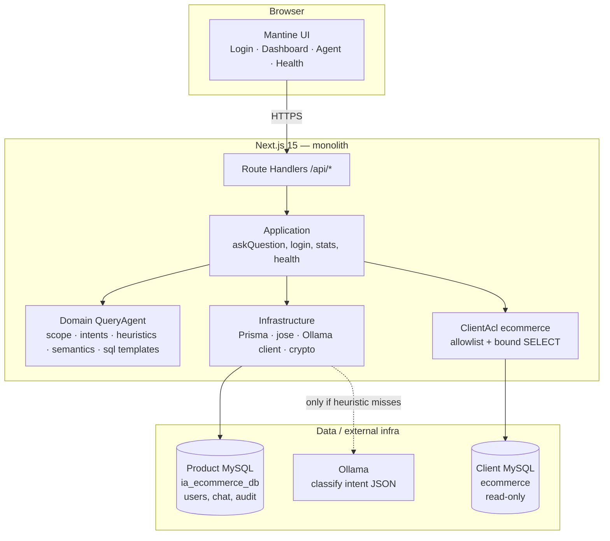
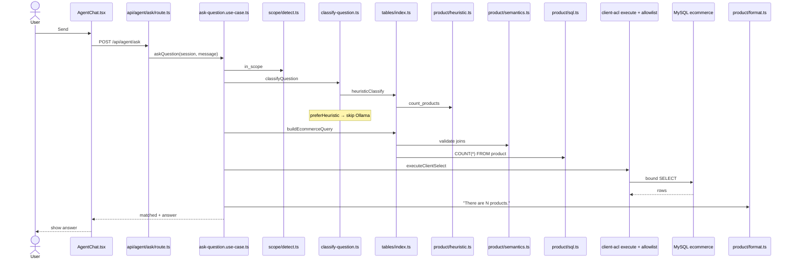

# IA-ECOMMERCE v3

English natural-language chat that answers with **real data** from the client ERP (**read-only**).  
MVP: AdventureWorks-style MySQL `ecommerce`. One Next.js deploy (UI + API).

Detailed docs: [docs/README.md](docs/README.md).

---

## 1. What the app is

| Screen | What it does |
|---|---|
| **Login** | Pilot employee (`founder` / `founder123`). JWT in an httpOnly cookie. |
| **Dashboard** | Agent usage KPIs and charts (last 7 days) from `ai_query_audit_log`. |
| **SQL Agent** | Natural-language question → fixed intent → safe SELECT → English answer. |
| **Health** | UP/DOWN for app, product MySQL, client DB, and Ollama. |

**Out of scope:** create/update/delete on the ERP, Maintenance/CRUD, free-form SQL from the LLM.

---

## 2. Architecture (what & why)

**Style:** *Modular monolith* + *Hexagonal (ports & adapters)* inside Next.js ([ADR-001](docs/architecture/ADR/ADR-001-architecture.md)).

- **One monolith** → one deploy; enough for a single operator/pilot.
- **Dependencies point inward** → domain never imports Prisma or Ollama; infra can change without rewriting the chat.
- **ACL per `system_type`** → client ERP does not pollute our domain; only allowlisted SELECTs.
- **LLM classifies, does not write SQL** → fixed intents + deterministic builders ([ADR-004](docs/architecture/ADR/ADR-004-query-engine.md)).



| Diagram block | What it does | Why we use it |
|---|---|---|
| **Mantine UI** | Screens and forms. | Fast, consistent B2B UI without reinventing components. |
| **Route Handlers** | HTTP entry (`/api/auth`, `/api/agent/ask`, …). | API lives in the same Next app → one deploy. |
| **Application** | Use cases that orchestrate the flow. | Testable application rules outside React. |
| **Domain QueryAgent** | Intent catalog, scope, SQL templates. | “What can be asked” is versioned code. |
| **ClientAcl** | Turns `QueryPlan` → bound SELECT + allowlist. | Isolates client schema; blocks injection. |
| **Infrastructure** | Prisma, JWT, Ollama fetch. | Tech details at the edge; swappable. |
| **Product MySQL** | Login, day conversation, audit, suggestions. | Our model — not the ERP. |
| **Client MySQL** | Products, orders, reviews, customers. | Commercial source of truth; **read-only**. |
| **Ollama** | If heuristic fails, proposes intent JSON. | Local classification; **never** emits executable SQL. |

### Patterns in the codebase

| Pattern | Where |
|---|---|
| Use case / application service | `src/query-agent/application/ask-question.use-case.ts` |
| Registry + strategy (per-table modules) | `src/query-agent/domain/tables/index.ts` |
| Pipeline | scope → classify → build → execute → format → audit |
| Semantic layer (per-intent contract) | `*/semantics.ts` + `domain/semantics/validate.ts` |
| Anti-Corruption Layer | `src/client-acl/ecommerce/` |

---

## 3. Technologies (what / for what / why)

| Technology | What it does | Why we use it |
|---|---|---|
| **Next.js 15** (App Router) | UI + API in one repo. | One deploy, clear routes, first-class TypeScript. |
| **React 19** | Screen components. | Standard Next stack. |
| **TypeScript** | Types for plans, DTOs, SQL builders. | Fewer errors in intents and API contracts. |
| **Mantine 7** | Layout, forms, tables, notifications. | Fast admin/B2B UI productivity. |
| **Recharts** | Dashboard + reusable charts (`presentation/charts`). | Declarative charts; ready for agent chart payloads later. |
| **react-icons** | Shell and tip icons. | Lightweight and consistent. |
| **Prisma** | ORM on `ia_ecommerce_db`. | Versioned schema, seed, typed client. |
| **MySQL** | Product + client (two databases). | Typical ERP; product isolated from client. |
| **Zod** | Validate API bodies. | Clear 400s without ad-hoc checks. |
| **jose** | Sign/verify session JWT. | httpOnly auth without Passport. |
| **bcryptjs** | Hash app-user passwords (seed). | Standard for our own credentials. |
| **Ollama** | Local LLM: classify → intent JSON. | No mandatory SaaS; data stays local. |
| **Vitest** | Unit tests (heuristics, semantics, scope). | Fast feedback on the question catalog. |

---

## 4. App modules (summary)

```text
src/
  app/                  # Next routes (pages + /api)
  presentation/         # UI: agent, dashboard, charts, shell, auth, health
  query-agent/          # Domain + use cases for analytics chat
    application/        # askQuestion, getDashboardStats
    domain/
      scope/            # write_blocked | out_of_scope | unmapped_read
      semantics/        # types + join validation
      tables/<entity>/  # intents, heuristic, prompt, sql, format, semantics
  client-acl/ecommerce/ # Allowlist + execute client SELECT
  identity/             # login / tenant context
  conversation/         # day thread
  infrastructure/       # Prisma, auth, LLM, crypto
  shared/               # env, helpers
```

| File in `tables/product`, `review`, … | Role |
|---|---|
| `intents.ts` | Canonical catalog names. |
| `heuristic.ts` | EN phrases → intent + filters (preferred path). |
| `prompt.ts` | LLM section when classify needs the model. |
| `sql.ts` | SELECT templates + bound params. |
| `format.ts` | English answer from result rows. |
| `semantics.ts` | Metric, grain, joins, filters (traceability). |

---

## 5. Example query: *"How many products are there?"*

Happy path: **heuristic → `count_products`** (Ollama is **not** called).



### Files in order

| # | File | One-line role |
|---|---|---|
| 1 | `src/app/(app)/agent/page.tsx` | Mounts the agent screen. |
| 2 | `src/presentation/agent/AgentChat.tsx` | Input + Send; calls the API. |
| 3 | `src/middleware.ts` | Checks session cookie presence. |
| 4 | `src/app/api/agent/ask/route.ts` | Zod body + session gate. |
| 5 | `src/infrastructure/auth/require-session.ts` | Verifies JWT. |
| 6 | `src/query-agent/application/ask-question.use-case.ts` | Orchestrates classify → SQL → audit. |
| 7 | `src/query-agent/domain/scope/detect.ts` | Write / out of catalog / in_scope? |
| 8 | `src/infrastructure/llm/classify-question.ts` | Heuristic first; LLM only if needed. |
| 9 | `src/query-agent/domain/tables/index.ts` | Module registry + build/format. |
| 10 | `src/query-agent/domain/tables/product/heuristic.ts` | Maps to `count_products`. |
| 11 | `src/query-agent/domain/tables/product/semantics.ts` | Contract: `product` joins (+ category if needed). |
| 12 | `src/query-agent/domain/semantics/validate.ts` | SQL must not touch undeclared tables. |
| 13 | `src/query-agent/domain/tables/product/sql.ts` | Builds `SELECT COUNT(*) …`. |
| 14 | `src/client-acl/ecommerce/build-query.ts` | Facade into the registry. |
| 15 | `src/client-acl/ecommerce/allowlist.ts` | Allowed tables/verbs only. |
| 16 | `src/client-acl/ecommerce/execute.ts` | Runs SELECT on the client DB. |
| 17 | `src/query-agent/domain/tables/product/format.ts` | Final English sentence. |
| 18 | Prisma (`ai_query_audit_log`, `message`) | Audits and stores the chat turn. |

**Intent:** `count_products` · **Classify source:** `heuristic` · **SQL:** count on `product`.

If the question is **related but unmapped** → `unmapped_read` (fixed message + suggestions).  
If it asks create/update/delete → `write_blocked` (read-only).  
If it is outside the ecommerce catalog → `out_of_scope`.

---

## 6. Local setup

1. Copy env:

```bash
cp .env.example .env
```

2. Edit `.env`: `DB_*`, `JWT_SECRET`, Ollama URL, etc.

3. Create the product database:

```sql
CREATE DATABASE ia_ecommerce_db CHARACTER SET utf8mb4 COLLATE utf8mb4_unicode_ci;
```

4. Schema + seed:

```bash
npm install
npm run db:setup
```

Seed: pilot company, user **founder** / **founder123**, client connection to `ecommerce`.

5. Run:

```bash
npm run dev
```

Open `http://localhost:3000/login` (browser Host must match seeded `host_key`, e.g. `localhost:3000`).  
Ollama must be UP if you want LLM classify for questions without a heuristic match.

### Useful scripts

| Script | Use |
|---|---|
| `npm run dev` | Local app |
| `npm test` | Vitest (catalog, semantics, scope, …) |
| `npm run test:product-questions` | Product question fixture |
| `npm run db:setup` | generate + push + seed |

---

## 7. MVP status (summary)

| Area | Status |
|---|---|
| Login + host tenant | Done |
| Dashboard KPIs + charts | Done |
| Agent chat (heuristic + LLM classify + safe SQL) | Done |
| Scope gate (write / out_of_scope / unmapped) | Done |
| Tables: product, review, sales header/detail, customer, mixed seed | Done |
| Reusable generic charts | Done (`presentation/charts`) |
| Health probes | Done |
| Maintenance / ERP writes | Out of scope |
| SAP / other `system_type` | Pending (same ACL pattern) |
